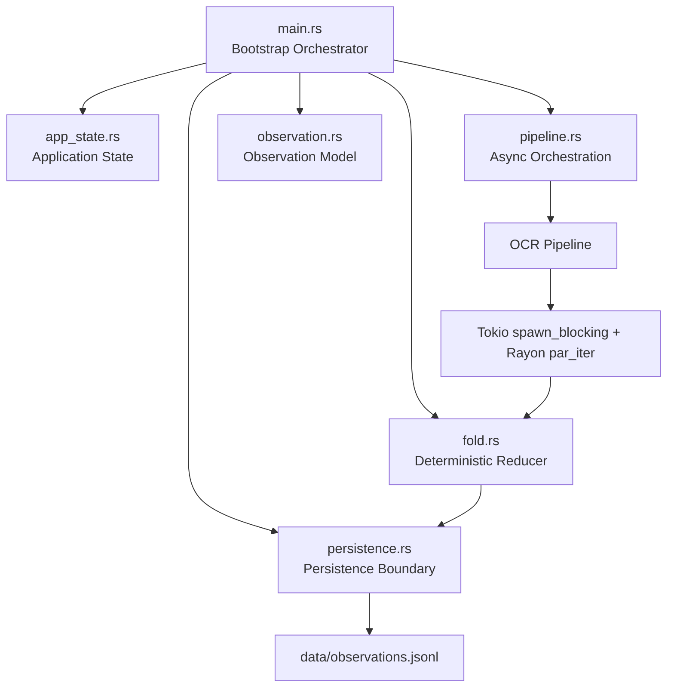
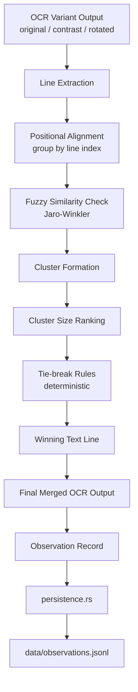

# OPTIMO

Deterministic OCR pipeline in Rust with Tokio + Rayon orchestration and Tesseract execution.

The project explores a strongly decoupled processing architecture where OCR acts only as an input generator for a deterministic pipeline.

---

# Architecture



The architecture separates:

- orchestration
- deterministic logic
- observation
- persistence

This allows the core logic to remain deterministic and replayable.

---

## Non-Negotiable Invariants

1. **Reducer purity**  
  The reducer must remain pure, deterministic, and free of side effects.

2. **External metadata injection**  
  Timestamps, ids, and other non-deterministic metadata must come from the runtime layer.

3. **Persistence boundary isolation**  
  Storage concerns must stay outside the core and pass only through the bridge.

4. **Derived event model**  
  Events must be derived from reducer results, not emitted as computation side effects.

5. **First-class observability**  
  Observations are part of the system contract and must remain structured and auditable.

See the full decision log: [docs/DECISIONS.md](docs/DECISIONS.md).

Mathematical triad formalization: [docs/TRIAD_FORMALISM.md](docs/TRIAD_FORMALISM.md).

---

# Project Structure

```text
src/

main.rs                # Bootstrap and runtime startup

app_state.rs           # Application state (paths, dirs, OCR language)

pipeline.rs            # Async orchestration (Tokio + Rayon boundary)

fold.rs                # Deterministic merge/vote logic

observation.rs         # Observation model and validation rules

persistence.rs         # Persistence boundary (JSONL + SQLite)

ocrys/
  mod.rs               # OCR facade
  tesseract.rs         # Tesseract CLI integration
  normalize.rs         # (legacy/experimental normalization)
  types.rs             # OCRDocument / OCRPage / OCRLine

scripts/

setup_data.sh          # Prepare data directories and ownership
process_all.sh         # Run all images via Docker image
process_all_local.sh   # Run all images locally via cargo
```

---

# Processing Model

1. `main.rs` loads `AppState` and parses input document paths.

2. `pipeline.rs` schedules one async task per document using `JoinSet`.

3. Each document crosses into CPU workers using `spawn_blocking`.

4. Rayon executes OCR variants in parallel:

   - `original`
   - `high_contrast`
   - `rotated`

5. `fold.rs` merges variant outputs deterministically using fuzzy clustering:

   - line alignment by position (line index as positional proxy)
   - similarity scoring via `strsim::jaro_winkler`
   - stable winner selection by cluster size
   - deterministic tie-break rules

6. The final observation is appended by `persistence.rs` to:

```
data/observations.jsonl
```

---

# Deterministic Reducer Logic



## Reducer Algorithm

The reducer merges OCR variants deterministically.

Processing steps:

1. Extract lines from each OCR variant.
2. Align candidate lines by position (current implementation: line index).
3. Compare textual similarity using Jaro-Winkler.
4. Build clusters of similar lines across OCR variants.
5. Rank clusters by size.
6. Select the winning line using deterministic tie-break rules.
7. Produce a final merged output.
8. Emit an observation record describing the decision.

## Reducer Contract

```text
Input:
  OCRVariant[]

Output:
  DeterministicMergedOCR

Guarantees:
  - deterministic output
  - stable tie-break rules
  - replayable decisions
```

---

# Runtime and Dependencies

Core stack:

- **Language / Runtime**: Rust + Tokio async runtime
- **OCR Engine**: Tesseract CLI
- **Parallel Compute**: Rayon
- **Serialization**: serde + serde_json
- **String Similarity**: strsim (Jaro-Winkler)

---

# Run Locally

Requires a local Tesseract installation.

```
cargo run -- fixtures/sample.png
```

Replay mode (skeleton):

```
cargo run -- --replay
```

Replay for one document checkpoint:

```
cargo run -- --replay <document_uuid>
```

Batch process a folder:

```
./scripts/process_all_local.sh fixtures
```

---

# Run with Docker (Recommended)

Build image:

```
docker build -t optimo:latest .
```

Run one file:

```
mkdir -p data

docker run --rm \
-v "$(pwd)/fixtures:/app/fixtures:ro" \
-v "$(pwd)/data:/app/data" \
optimo:latest /app/fixtures/sample.png
```

Run all images in a folder:

```
./scripts/process_all.sh fixtures
```

---

# Output

```
data/observations.jsonl
```

Append-only decision records (one JSON object per line).

Artifacts generated during runs:

```
data/ocrys/latest/
```

Example record:

```json
{"decision":"ocr_converged","lines":3,"preview":"hello world ocr test 2024 optimo pipeline ","source":"/app/fixtures/sample.png"}
```

---

# Replay Engine Status (Apr 2026)

## ✅ Implemented

- **Deterministic replay from genesis**: Events ordered by timestamp + id, folded with pure reducer
- **Checkpoint + tail replay**: Load latest snapshot, hydrate state, apply tail events
- **Rigorous snapshot hydration**: 
  - Validates schema_version, document_id/source coherence, confidence match
  - Fails explicitly before any reducer contamination
  - Distinguishes projection (reporting) from rehydration (fold resume)
- **Equivalence test**: Genesis and checkpoint+tail replay produce identical final state ✓
- **Failure mode tests**: 5 tests guarantee no panic, no zombie state on corruption

## 🧪 Test Suite

```
cargo test timequake::tests
```

- `final_state_is_identical_genesis_vs_checkpoint_plus_tail`: proves equivalence
- `snapshot_must_fail_before_hydration_when_rehydration_missing`: guards payload completeness
- `snapshot_must_fail_on_document_id_source_mismatch`: guards cross-document contamination
- `snapshot_must_fail_on_empty_source`: guards invalid hydration input
- `snapshot_must_fail_on_confidence_mismatch_after_recompute`: guards metric consistency

All 5 tests **pass** ✓

## 📋 Next Steps (Architected)

1. **Schema Evolution**: versioned migrations for snapshot format changes
2. **Integrity Hash Chain**: snapshot_hash + tail_chain_hash for audit/corruption detection
3. **Observation Replay**: emit_observation in replay flow with deterministic metadata

---

- Default OCR language in `AppState` is currently `ita`.
- `observation.rs` already defines richer typed observations (`OcrObservation`) for the next persistence phase.
- JSONL is the current persistence backend.
- SQLite is implemented behind `persistence.rs` without changing reducer or orchestration logic.
- Replay engine is implemented in `timequake.rs`:
  - deterministic event ordering (`timestamp`, `id`)
  - genesis replay (`events` only)
  - checkpoint + tail replay (`latest snapshot` + `events after cutoff`)
  - hydration based on canonical rehydration payload stored in snapshot

---

# Architectural Direction

OCR is currently used only as a **pipeline stress-test and input generator**.

The long-term objective is a deterministic document analysis engine where:

- parsing
- validation
- rule evaluation
- structural checks

can run through the same reducer/observation pipeline.

This design allows the system to evolve without modifying the deterministic core.
