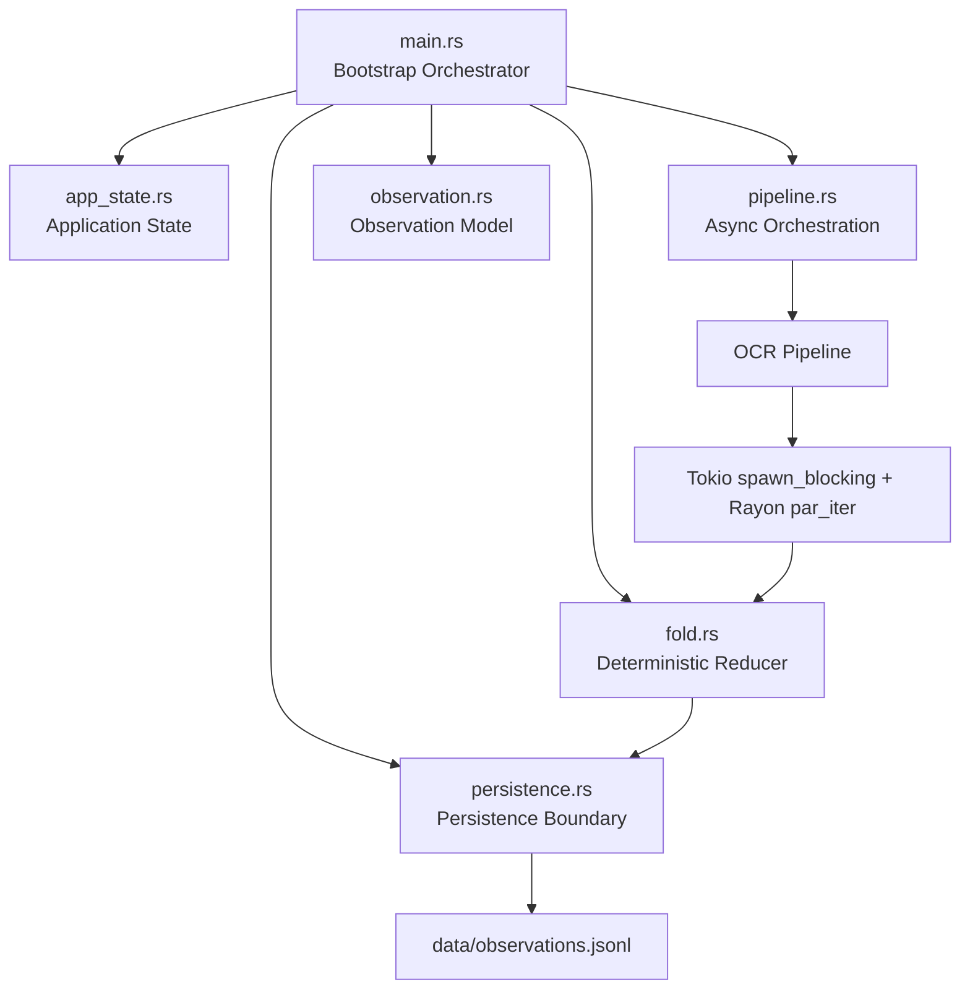
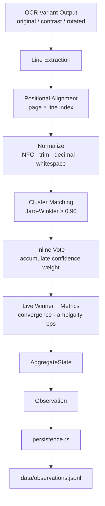

# LOGBOOK

Technical notes, architecture snapshots, and decisions accumulated during development.
This is the living record of what Optimo was, is, and is becoming.

---

## Architecture Snapshot (Apr 2026)



The architecture separates:

- orchestration
- deterministic logic
- observation
- persistence

---

## Non-Negotiable Invariants

1. **Reducer purity** — the reducer must remain pure, deterministic, and free of side effects.
2. **External metadata injection** — timestamps, ids, and other non-deterministic metadata must come from the runtime layer.
3. **Persistence boundary isolation** — storage concerns must stay outside the core.
4. **Derived event model** — events must be derived from reducer results, not emitted as side effects.
5. **First-class observability** — observations are part of the system contract.

---

## Module Map (Apr 2026)

```text
src/

main.rs                # Bootstrap and runtime startup
app_state.rs           # Application state (paths, dirs, OCR language)
pipeline.rs            # Async orchestration (Tokio + Rayon boundary)
fold.rs                # Deterministic weighted positional reducer
observation.rs         # Observation model and validation rules
persistence.rs         # Persistence boundary (JSONL + SQLite)
timequake.rs           # Temporal replay core (deterministic, no I/O)
aggregate_state.rs     # Fold-derived deterministic state
snapshot.rs            # Structural projection + rehydration payload
profile.rs             # Ingestion profile (enum + config)
config.rs              # Config resolution (CLI > ENV > FILE > DEFAULT)

ocrys/
  mod.rs               # OCR facade
  tesseract.rs         # Tesseract CLI integration
  normalize.rs         # Canonical line normalization
  types.rs             # OCRDocument / OCRPage / OCRLine

scripts/

setup_data.sh          # Prepare data directories
process_all.sh         # Run all images via Docker
process_all_local.sh   # Run all images locally via cargo
```

---

## Processing Model

1. `main.rs` loads `AppState` and parses input document paths.
2. `pipeline.rs` schedules one async task per document using `JoinSet`.
3. Each document crosses into CPU workers using `spawn_blocking`.
4. Rayon executes OCR variants in parallel: `original`, `high_contrast`, `rotated`.
5. `fold.rs` merges variant outputs using inline weighted positional voting:
   - group evidence by logical position (page, line)
   - normalize text (NFC, trim, whitespace collapse, decimal comma harmonization)
   - cluster similar candidates via Jaro-Winkler
   - accumulate confidence weights incrementally
   - recompute winner and convergence/ambiguity scores after each vote
6. The final observation is appended by `persistence.rs`.

---

## Reducer Flow



### Reducer Contract

```text
Input:   Vec<OCRDocument>
Output:  AggregateState

Guarantees:
  - deterministic: same input → same output
  - order-independent: stable under permutation
  - replayable: no I/O, no timestamps, no randomness
  - convergence viva: metrics updated per incoming line
```

---

## Replay Engine (Apr 2026)

### Implemented

- Deterministic replay from genesis (events ordered by timestamp + id)
- Checkpoint + tail replay (latest snapshot + events after cutoff)
- Rigorous snapshot hydration:
  - validates schema_version, document_id/source coherence, confidence match
  - fails explicitly before any reducer contamination
  - separates projection (reporting) from rehydration (fold resume)
- Equivalence test: genesis and checkpoint+tail replay produce identical final state ✓
- Failure mode tests: 5 tests guarantee no panic, no zombie state on corruption

### Test Suite

```bash
cargo test timequake::tests
```

All 5 tests pass ✓

### Next Steps (Architected)

1. Schema Evolution — versioned migrations for snapshot format
2. Integrity Hash Chain — snapshot_hash + tail_chain_hash for audit
3. Observation Replay — emit_observation in replay flow with deterministic metadata

---

## Run Notes

### Local

```bash
cargo run -- fixtures/sample.png
cargo run -- --replay
cargo run -- --replay <document_uuid>
./scripts/process_all_local.sh fixtures
```

### Docker

```bash
docker build -t optimo:latest .

docker run --rm \
  -v "$(pwd)/fixtures:/app/fixtures:ro" \
  -v "$(pwd)/data:/app/data" \
  optimo:latest /app/fixtures/sample.png

./scripts/process_all.sh fixtures
```

### Output

```
data/observations.jsonl     # append-only decision records
data/ocrys/latest/          # OCR artifacts per run
```

---

## Stack Notes

- Default OCR language: `ita`
- Persistence: JSONL (primary) + SQLite (parallel, queryable)
- `observation.rs` defines typed `OcrObservation` for structured audit
- `timequake.rs` is the canonical replay engine; no business logic, no I/O
- `profile.rs` drives normalization policy per ingestion source
- Config precedence: CLI > ENV > FILE (`optimo.yml`) > DEFAULT

---

## Architectural Direction

OCR is currently used only as a pipeline stress-test and input generator.

Long-term objective: a deterministic document analysis engine where parsing, validation, rule evaluation, and structural checks run through the same reducer/observation pipeline — without modifying the deterministic core.

---

## Reducer Hardening (May 2026)

### What changed

The fold engine matured from a weighted voting prototype into a semantically strict evidence reducer. Seven distinct properties were strengthened:

**Algebraic properties — formally tested**
- Commutativity: reducing `[A, B, C]` in any permutation produces identical output
- Idempotence: duplicate documents do not create phantom clusters or inflate scores
- Monotonicity: additional confirming evidence never decreases the convergence score
- Batch/incremental equivalence: `reduce([A,B,C])` ≡ `empty.update(A).update(B).update(C)` within ±1 bps

**Fuzzy clustering with anti-homoglyph guardrails**
- Jaro-Winkler clustering on NFC-normalized, case-folded cluster keys
- `same_script_family()` guard blocks Cyrillic–Latin homoglyph injection (e.g. `і` U+0456 silently merging with `i`)
- Case-insensitive matching with original-variant preservation in the winner display
- `sanitize_variant_display()` strips control characters and zero-width codepoints before BTreeMap storage

**Hard idempotency via source fingerprint**
- Items are deduplicated by `(position, cluster_key, source)` before entering the fold
- The same OCR source cannot vote twice for the same cluster at the same position
- Deduplication is order-independent (applied after the deterministic sort)

**`collision_rate_bps` — runtime convergence metric**
- `InlineFoldState` tracks `total_votes` and `collisions` (votes that merged into an existing cluster)
- Exposed as `AggregateState.collision_rate_bps` (serializable; `serde(default = 0)` for backward-compatible snapshots)
- High collision rate indicates dense, well-converging inputs

**Configurable `similarity_threshold` per document type**
- `IngestionProfile` gains a `similarity_threshold: f64` field
- `tesseract` / `legacy_import`: 0.90 — tolerant of OCR noise
- `carbo` / `strict`: 0.95 — tighter; `"Rck30"` ≠ `"Rck 30"`
- New public API: `reduce_documents_with_profile(docs, profile)`

**Image preprocessing pipeline**
- `src/ocrys/preprocess.rs`: ROI extraction → grayscale → Otsu thresholding → optional resize → PNG
- `Roi { x, y, width, height, kind: RegionKind, resize: Option<(u32, u32)> }`
- `RegionKind`: `TitleBlock`, `InvoiceTotals`, `StructuralTable`, `Signature`
- Otsu implementation with explicit fallback to 128 for empty/flat histograms (no division-by-zero)

### Test suite

```text
83 tests — all passing
  fold::tests              9   core reducer invariants
  fold_adversarial::tests  17  arithmetic safety, degenerate inputs, normalization, clustering, security
  fold_properties::tests   7   algebraic property proofs
  ocrys::preprocess::tests 8   ROI pipeline and Otsu thresholding
  aggregate_state::tests   6   snapshot hydration and profile enforcement
  timequake::tests         5   replay engine equivalence
  + config, profile, snapshot, observation, normalize
```

```bash
cargo test
```
